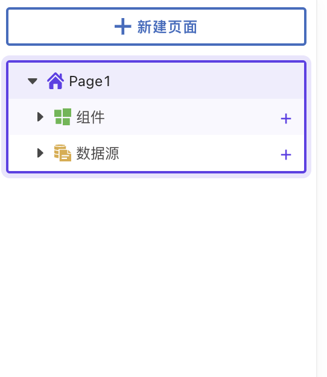

# 数据面板

学习使用本平台在真实的业务数据集上构建功能完整的内部应用程序。该应用程序是一个数据面板，可让您浏览所有业务信息，并审核用户提供的个人评论。


教程信息

⭐ 等级: 初学者\
⏱️ 时长 小于二十分钟\
🙌 目标:

* 连接到数据源
* 将数据绑定到不同的组件上
* 尝试编写JS代码
* 部署应用



小提示: 您可以通过双击现有名称来重命名组件名称和查询名称等。


第一次进入低代码平台，将在左侧自动生成资源管理器。下面是屏幕截图。

> 资源管理器是您可以创建和管理UI组件和数据源的地方。此外，您还可以在这些部分下找到您可以使用的不同集成。

现在，让我们将页面从`Page1`重命名为`Business Detail`吧。您可以通过双击现有名称来执行此操作。

太棒了！接下来，让我们进入下一部分，在这里您将连接到一个数据源，并编写您的第一个数据库查询！


[connecting-to-data-source-and-binding-queries.md](connecting-to-data-source-and-binding-queries.md)

